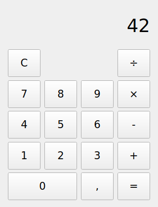

# Calculatrice

Une calculatrice de bureau simple, pour les quatre opérations (addition,
soustraction, multiplication, division), construite comme démonstration
d'une petite application desktop développée de façon incrémentale.



## Lancer l'application (environnement de développement)

```bash
pip install -e ".[dev]"
python -m calculatrice.fenetre
```

Ou, après installation :

```bash
calculatrice
```

## Lancer les tests

```bash
QT_QPA_PLATFORM=offscreen python -m pytest tests/ -v
```

(La variable `QT_QPA_PLATFORM=offscreen` permet d'exécuter les tests sans
serveur d'affichage graphique — utile en CI ou en environnement headless.
Elle n'est pas nécessaire sur un poste de développement normal.)

## Structure du projet

```
src/calculatrice/
  moteur.py    # Logique de calcul pure, sans dépendance à l'IHM
  fenetre.py   # Interface graphique (PySide6 / Qt6)
tests/
  test_moteur.py   # Tests unitaires de la logique
  test_fenetre.py  # Tests d'intégration de l'IHM (simulation de clics)
ARCHITECTURE.md     # Historique des décisions de conception
```

## Choix techniques

Voir [`ARCHITECTURE.md`](ARCHITECTURE.md) pour le détail et la justification
des choix (langage, framework IHM, stratégie de test, etc.).
